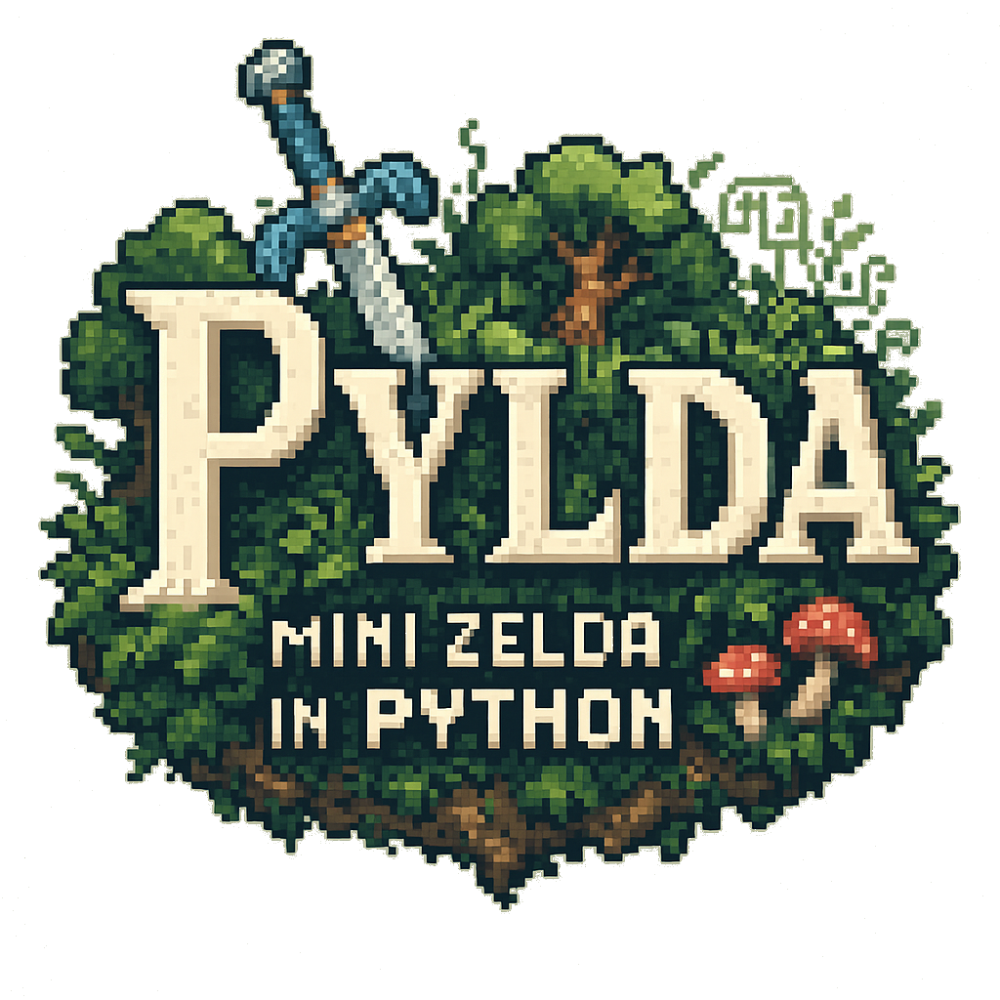
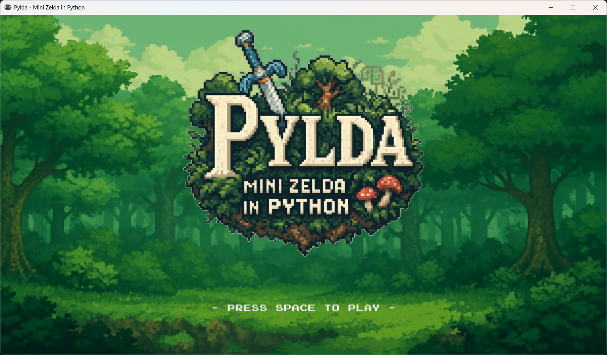
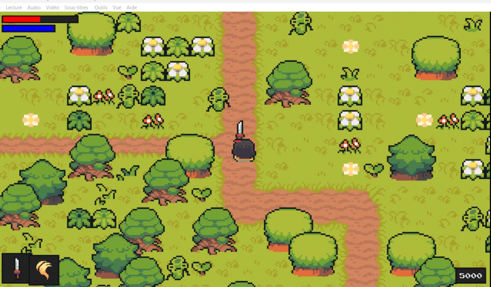
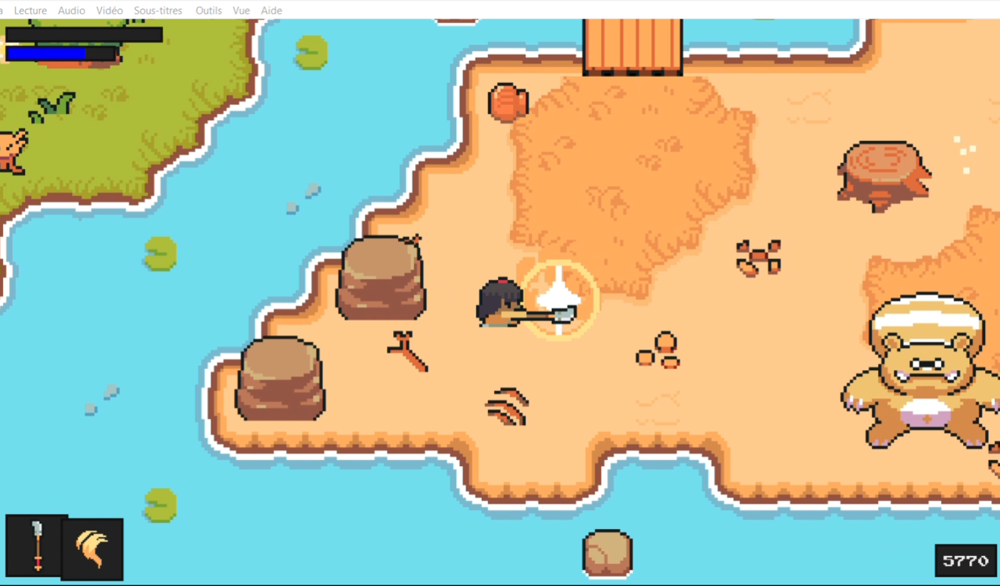
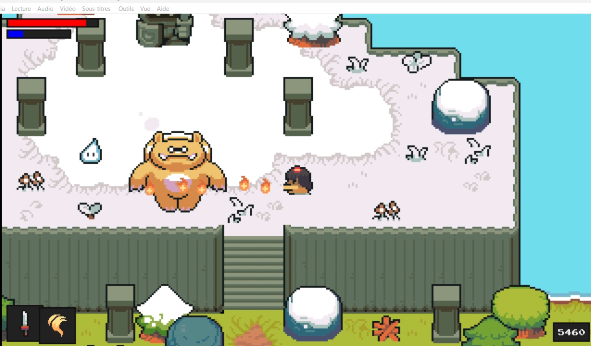

# 🗡️ Pylda - Mini Zelda in Python
<p align='center'>
    
</p>
**Pylda** is a mini adventure game project inspired by *The Legend of Zelda*, built using **Python** and **Pygame**.

⚠️ This is **not a complete or commercial game** — it's a personal learning project to practice game development and improve my understanding of Pygame.

---

## 🎮 Screenshots

### 🟩 Main Menu  
A pixel-art menu screen with custom logo and forest background.



### 🌲 Forest Exploration  
Walk freely in a vibrant 2D forest made of pixel tiles.



### ⚔️ Combat and Weapon Switching  
Fight monsters and change weapons dynamically during gameplay.



### ✨ Spell Casting  
Use magical abilities to attack enemies from a distance.



---

## 🎯 Project Goals

This project is primarily an **educational playground** where I explored:

- 💡 Building a basic action-RPG loop in Python
- 🧱 Creating a 2D tile-based world with collision
- 🧙 Custom UI for health, energy, EXP, and upgrades
- 🗡️ Real-time combat mechanics (weapons and spells)
- 🎨 Integrating pixel art graphics and animations
- 🔉 Adding sound effects and transitions
- 🧪 Structuring a modular Pygame project

---

## 🧰 Built With

- 🐍 Python 3.x  
- 🎮 [Pygame](https://www.pygame.org/)  

---

## 🚀 How to Run

1. Make sure Pygame is installed:

```bash
pip install pygame
```

2. Launch the game:

```bash
python main.py
```

Make sure you’re in the root folder of the project when you run it.

---


## 🔖 Features

- Custom pixel-art logo and menu background
- Smooth fade transitions
- Real-time combat with enemies
- Spellcasting and weapon switching
- Upgrade screen with stats progression
- Health / energy / EXP bars
- Basic AI (enemy detection, pursuit, attack)
- Modular code structure for easy readability

---

## 🙋‍♂️ Author

Developed by **BRAVO Diego**  
Feel free to use this project as a learning base or template for your own experiments in Python game dev.

---

## 🙏 Acknowledgements
- Thanks to [Clear Code Project](https://www.youtube.com/c/clearcode) for the tuto
- Graphics and Audio by [Pixel-Boy](https://twitter.com/2Pblog1) and [AAA](https://www.instagram.com/challenger.aaa/?hl=fr), you can download the assets [here](https://pixel-boy.itch.io/ninja-adventure-asset-pack)
- Inspired by classic Zelda-style games
- Thanks to the open-source community around Python and Pygame
- Logo and background generated using custom pixel art with help from AI

---

## 📝 Disclaimer

This project is **non-commercial**, built purely as a programming exercise.  
All graphics and sounds are for personal/educational use only.

---
